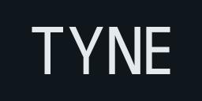

# Tyne ([docs](https://alexnoddings.github.io/Tyne/docs/)) ([demo](https://alexnoddings.github.io/Tyne/demo/))

Tyne is a set of C# packages designed to make line-of-business apps in Blazor more efficiently.

Packages are designed to be à la carte based on a project's requirements. For example, the Blazor components are usable without EF change auditing, and vice versa.

See [the package list](https://alexnoddings.github.io/Tyne/docs/packages/) for details about what packages are available, and how to install them.
