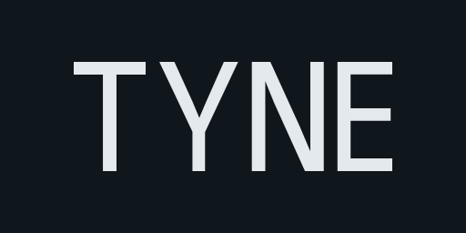

# Tyne ([docs](https://alexnoddings.github.io/Tyne/docs/)) ([demo](https://alexnoddings.github.io/Tyne/demo/))

Tyne is a series of packages designed around creating Blazor systems.

# Packages
| Package     | | Description |
| ----------- | ------------------------------------------------------------------------------------------ | ----------- |
| Tyne.Blazor | [docs](https://alexnoddings.github.io/Tyne/docs/packages/Tyne.Blazor) \| [src](src/Blazor) | Core functionality for other Tyne packages. |
| Tyne.Core   | [docs](https://alexnoddings.github.io/Tyne/docs/packages/Tyne.Core)   \| [src](src/Core)   | Blazor component library. |
