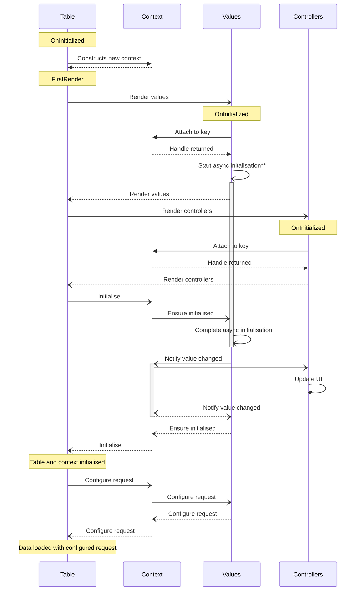
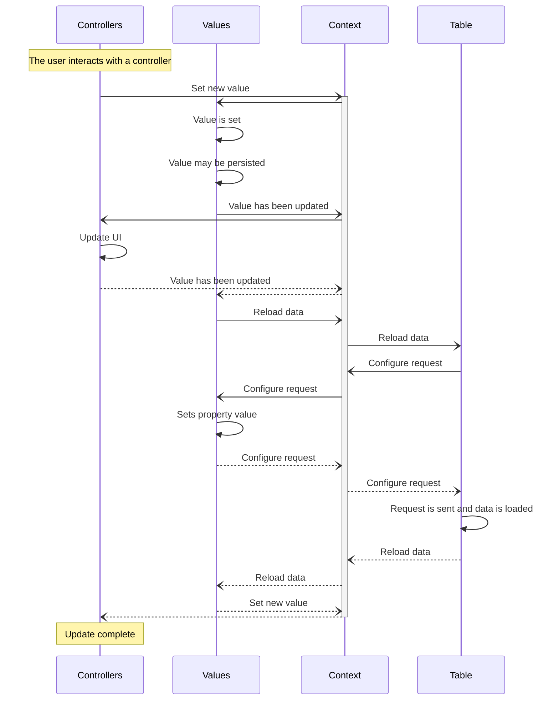

# Filtering diagrams
The following are diagrams on how a filter context is integrated with a table.
While each context can have many filters and controllers, these diagrams only show them as one participant for ease.

Solid lines indicate a method call. Dotted lines indicate said call returning.

### Initialisation
The table component is initialised. This creates a context, and renders the values and controllers.



\*\*The `Start async initialisation` step is simplified for the diagram.
This step takes place asynchronously in the background so that values may initialise simultaneously.
Initialisation may involve loading a persisted filter value, or loading values from an API.

### Controller updated
The user interacts with a controller, causing the value to be updated.



## Component implementations

#### Values
The [TyneFilterValue](xref:Tyne.Blazor.Filtering.Values.TyneFilterValue`2) component provides a simple implementation for filter values.
Selection values should use [TyneFilterSelectSingleValue](xref:Tyne.Blazor.Filtering.Values.TyneFilterSelectSingleValue`2)
or [TyneFilterSelectMultiValue](xref:Tyne.Blazor.Filtering.Values.TyneFilterSelectMultiValue`2).

If creating your own value type, you need to imlement [IFilterValue\<TRequest, TValue\>](xref:Tyne.Blazor.Filtering.Values.IFilterValue`2).
Alternatively, [TyneFilterValueBase](xref:Tyne.Blazor.Filtering.Values.TyneFilterValueBase`2)
does a lot of the heavy lifting of values and can be extended.

Example usage:

```razor
<TyneFilterValue TRequest="SearchParts.Request" TValue="string" For="m => m.Name" PersistAs="PartName" />
<TyneFilterSelectSingleValue TRequest="SearchParts.Request" TValue="PartSize?" For="m => m.Size" PersistAs="*">
    <Values>
        <TyneFilterSelectItem TValue="PartSize?" Value="null">Any</TyneFilterSelectItem>
        <TyneFilterSelectItem TValue="PartSize?" Value="PartSize.Small">Small</TyneFilterSelectItem>
        <TyneFilterSelectItem TValue="PartSize?" Value="PartSize.Medium">Medium</TyneFilterSelectItem>
        <TyneFilterSelectItem TValue="PartSize?" Value="PartSize.Large">Large</TyneFilterSelectItem>
        <TyneFilterSelectItem TValue="PartSize?" Value="PartSize.ExtraLarge">Xl</TyneFilterSelectItem>
    </Values>
</TyneFilterSelectSingleValue>
<TyneFilterValue TRequest="SearchParts.Request" TValue="DateTime?" For="m => m.CreatedAtMin" />
<TyneFilterValue TRequest="SearchParts.Request" TValue="DateTime?" For="m => m.CreatedAtMax" />
```

#### Controllers
Controllers vary more than values as each is specialised for a certain use case.

If creating your own controller type, you need to implement [IFilterController\<TValue\>](xref:Tyne.Blazor.Filtering.Controllers.IFilterController`1).
Alternatively, [TyneFilterControllerBase](xref:Tyne.Blazor.Filtering.Controllers.TyneFilterControllerBase`2)
does a lot of the heavy lifting of controllers which only attach to one value.

Below is a list of some of the controllers which Tyne provides.
See the [controllers namespace](xref:Tyne.Blazor.Filtering.Controllers) for the rest.

| Controller | Usage |
| ---------- | ----- |
| [`TyneStringFilterController`](xref:Tyne.Blazor.Filtering.Controllers.TyneStringFilterController`1) | Provides a simple text input box for use with string values |
| [`TyneCustomFilterController`](xref:Tyne.Blazor.Filtering.Controllers.TyneCustomFilterController`2) | Takes a `RenderFragment<T>` whose context references the value |
| [`TyneCustomMinMaxFilterController`](xref:Tyne.Blazor.Filtering.Controllers.TyneCustomMinMaxFilterController`2) | Similar to `TyneCustomFilterController`, but for a min/max value |
| [`TyneDateRangeFilterController`](xref:Tyne.Blazor.Filtering.Controllers.TyneDateRangeFilterController`1) | Provides a date range picker for min/max `DateTime`s |
| *[`TyneSingleSelectBoxFilterController`](xref:Tyne.Blazor.Filtering.Controllers.TyneSingleSelectBoxFilterController`2) | Provides a dropdown selection box for single select values |
| *[`TyneSingleSelectRadioFilterController`](xref:Tyne.Blazor.Filtering.Controllers.TyneSingleSelectRadioFilterController`2) | Provides radio buttons for single select values |
| *[`TyneMultiSelectBoxFilterController`](xref:Tyne.Blazor.Filtering.Controllers.TyneMultiSelectBoxFilterController`2) | Provides a dropdown selection box for multi select values |
| *[`TyneMultiSelectCheckboxFilterController`](xref:Tyne.Blazor.Filtering.Controllers.TyneMultiSelectCheckboxFilterController`2) | Provides checkboxes for multi select values |

\*Note that select controllers require the attached value to implement [`IFilterSelectValue<TValue>`](xref:Tyne.Blazor.Filtering.Values.IFilterSelectValue`1).

See the [tables page](../tables.md) for more information about controllers provided for use in table contexts.
