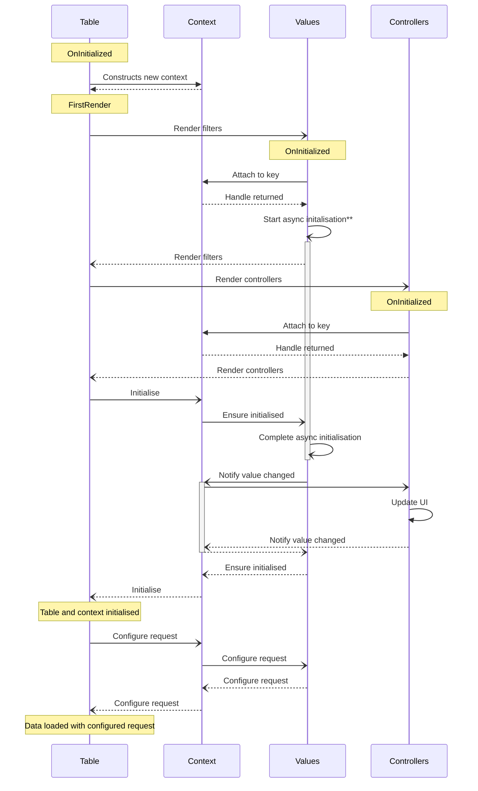
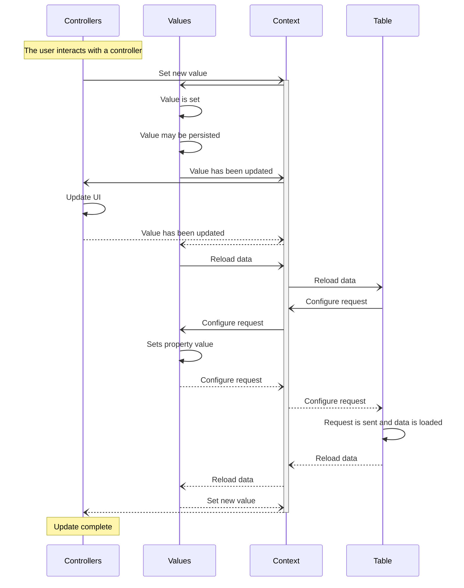

# Filtering

Tyne.Blazor provides a set of components for rich, interactive data filtering.

## Overview
Filtering is composed of the following elements:

#### Filter Context
The filter context orchestrates and manages the filtering taking place, and facilitates communication between values and controllers.

Components which use filtering (e.g. tables) will own a filter context which is used to configure filtering on a request,
and which may trigger the data in the context to be reloaded, such as when a value is changed.

#### Filter Value
A filter context may have multiple values attached to it.
These values store state, such as a string which a name column is being filtered by.
Values act purely as value stores - they do not render a UI, nor are they directly interacted with by a user.
Instead, values are manipulated by a controller.

#### Filter Controller
Filter controllers are how users interact with filter values.
Each filter value may have any number of controllers.
These do not store any state themselves - instead, they are interact with a filter value.

## Interacting with the filter context
Values and controllers do not interact directly with the context. Instead, they need to attach themselves.
This takes a [TyneKey](xref:Tyne.Blazor.TyneKey) and the object being attached, and returns a handle.
The handle is then used to communicate with the context (such as reloading data or updating a value),
and once disposed of will detach the object from the context.

When a filter context is initialised, the values must be attached first.
Values register with a key which identifies which property on the filter context (`TRequest`)
they intend to be the value for, for example a name or category property.
Only one value may be attached per property.

After values have been attached, controllers can be attached.
These require values to have been attached first, otherwise
the controller won't have anything to attach to.

Controllers also register with a key, this identifies which value they intent to attach to.
Any number of controllers may be attached to the same value. One controller may also
register to more than one value, such as a controller which manages a min/max date range.

## Diagrams
The following section contains diagrams on how a filter context is integrated with a table.
While each context can have many filters and controllers, these diagrams only show them as one participant for ease.

Solid lines indicate a method call. Dotted lines indicate said call returning.

### Initialisation
The table component is initialised. This creates a context, and renders the values and controllers.



\*\*The `Start async initialisation` step is simplified for the diagram.
This step takes place asynchronously in the background so that values may initialise simultaneously.
Initialisation may involve loading a persisted filter value, or loading values from an API.

### Controller updated
The user interacts with a controller, causing the value to be updated.



## Components

#### Values
The [TyneFilterValue](xref:Tyne.Blazor.Filtering.Values.TyneFilterValue`2) component provides a simple implementation for filter values.
Selection values should use [TyneFilterValue](xref:Tyne.Blazor.Filtering.Values.TyneFilterSelectSingleValue`2)
or [TyneFilterValue](xref:Tyne.Blazor.Filtering.Values.TyneFilterSelectMultiValue`2).

If creating your own value type, you need to imlement [IFilterValue\<TRequest, TValue\>](xref:Tyne.Blazor.Filtering.Values.IFilterValue`2).
Alternatively, [TyneFilterValueBase](xref:Tyne.Blazor.Filtering.Values.TyneFilterValueBase`2)
does a lot of the heavy lifting of values and can be extended.

Example usage:

```razor
<TyneFilterValue TRequest="SearchParts.Request" TValue="string" For="m => m.Name" PersistAs="PartName" />
<TyneFilterSelectSingleValue TRequest="SearchParts.Request" TValue="PartSize?" For="m => m.Size" PersistAs="*">
    <Values>
        <TyneFilterSelectItem TValue="PartSize?" Value="null">Any</TyneFilterSelectItem>
        <TyneFilterSelectItem TValue="PartSize?" Value="PartSize.Small">Small</TyneFilterSelectItem>
        <TyneFilterSelectItem TValue="PartSize?" Value="PartSize.Medium">Medium</TyneFilterSelectItem>
        <TyneFilterSelectItem TValue="PartSize?" Value="PartSize.Large">Large</TyneFilterSelectItem>
        <TyneFilterSelectItem TValue="PartSize?" Value="PartSize.ExtraLarge">Xl</TyneFilterSelectItem>
    </Values>
</TyneFilterSelectSingleValue>
<TyneFilterValue TRequest="SearchParts.Request" TValue="DateTime?" For="m => m.CreatedAtMin" />
<TyneFilterValue TRequest="SearchParts.Request" TValue="DateTime?" For="m => m.CreatedAtMax" />
```

#### Controllers
Controllers vary more than values as each is specialised for a certain use case.

If creating your own controller type, you need to implement [IFilterController\<TValue\>](xref:Tyne.Blazor.Filtering.Controllers.IFilterController`1).
Alternatively, [TyneFilterControllerBase](xref:Tyne.Blazor.Filtering.Controllers.TyneFilterControllerBase`2)
does a lot of the heavy lifting of controllers which only attach to one value.

Tyne provides the following controllers:

| Controller | Usage |
| ---------- | ----- |
| [`TyneStringFilterController`](xref:Tyne.Blazor.Filtering.Controllers.TyneStringFilterController`1) | Provides a simple text input box for use with string values |
| [`TyneCustomFilterController`](xref:Tyne.Blazor.Filtering.Controllers.TyneCustomFilterController`2) | Takes a `RenderFragment<T>` whose context references the value |
| [`TyneCustomMinMaxFilterController`](xref:Tyne.Blazor.Filtering.Controllers.TyneCustomMinMaxFilterController`2) | Similar to `TyneCustomFilterController`, but for a min/max value |
| [`TyneDateRangeFilterController`](xref:Tyne.Blazor.Filtering.Controllers.TyneDateRangeFilterController`1) | Provides a date range picker for min/max `DateTime`s |
| [`TyneSingleSelectBoxFilterController`](xref:Tyne.Blazor.Filtering.Controllers.TyneSingleSelectBoxFilterController`2) | Provides a dropdown selection box for single select values |
| [`TyneSingleSelectRadioFilterController`](xref:Tyne.Blazor.Filtering.Controllers.TyneSingleSelectRadioFilterController`2) | Provides radio buttons for single select values |
| [`TyneMultiSelectBoxFilterController`](xref:Tyne.Blazor.Filtering.Controllers.TyneMultiSelectBoxFilterController`2) | Provides a dropdown selection box for multi select values |
| [`TyneMultiSelectCheckboxFilterController`](xref:Tyne.Blazor.Filtering.Controllers.TyneMultiSelectCheckboxFilterController`2) | Provides checkboxes for multi select values |

See the [tables page](./tables.md) for more information about controllers provided for use in table contexts.
