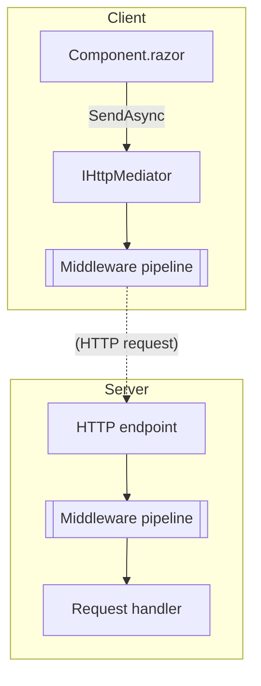
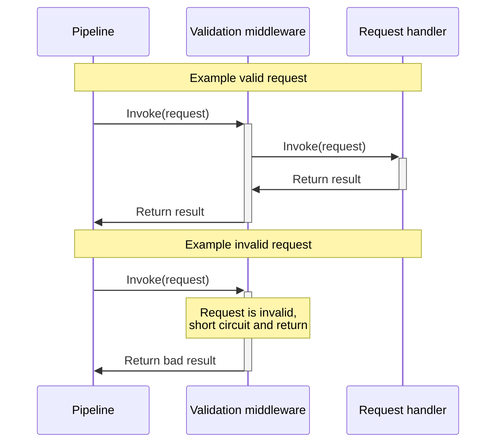
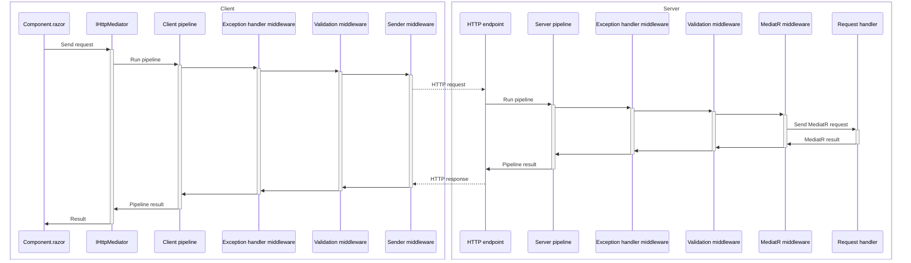

# HTTP Mediator packages

| Package | Description |
| ------- | ----------- |
| [HttpMediator.Client](./HttpMediator/HttpMediator.Client.md)                                   | Client implementation of Tyne's HTTP Mediator. |
| [HttpMediator.Client.FluentValidation](./HttpMediator/HttpMediator.Client.FluentValidation.md) | Fluent Validation middleware for Tyne's client HTTP Mediator. |
| [HttpMediator.Core](./HttpMediator/HttpMediator.Core.md)                                       | Core library of Tyne's HTTP Mediator. |
| [HttpMediator.Server](./HttpMediator/HttpMediator.Server.md)                                   | Server implementation of Tyne's HTTP Mediator. |
| [HttpMediator.Server.FluentValidation](./HttpMediator/HttpMediator.Server.FluentValidation.md) | Fluent Validation middleware for Tyne's server HTTP Mediator. |
| [HttpMediator.Server.MediatR](./HttpMediator/HttpMediator.Server.MediatR.md)                   | MediatR middleware for Tyne's server HTTP Mediator. |

# Overview
Tyne's HTTP Mediator is an end-to-end Client/Server implementation of the Mediator pattern.

Clients can inject [IHttpMediator](xref:Tyne.HttpMediator.Client.IHttpMediator), which will send requests to the server to be processed.

The general flow is as follows:

## Middleware
HTTP Mediator middleware is similar to ASP.NET Core's implementation.
Middlewares are registered in the order they will be executed during configuration
(e.g. [client](./HttpMediator/HttpMediator.Client.md), [server](./HttpMediator/HttpMediator.Server.md)).
Their purpose is to generically handle requests, such as validating them or handling exceptions to return an error result.

The client pipeline is responsible for taking the user's request and sending it to the server.
The server pipeline is responsible for handling requests from an endpoint.

### Terminal middleware
Terminal middlewares are the final steps in a pipeline, and execute the request. For example, the HTTP sender middleware on the client is terminal as it is responsible for sending the request, and transforming it into a response.

### Short-circuiting middleware
Some middlewares can short circuit the pipeline. This allows a middleware to return without executing the rest of the pipeline, such as when validating a request.

For example, the server can validate the request. If valid, the request handler is invoked. Otherwise, the pipeline can short circuit and return a bad result:

### End-to-end request example

# Request type
Request types need to implement [IHttpRequestBase](xref:Tyne.HttpMediator.IHttpRequestBase`1). This gives Tyne metadata about how the client and server should communicate, and acts as a marker so that the mediator knows what return type it should expect.

# Request encoding
`GET` and `DELETE` requests serialise the request to the URL. `POST`, `PUT`, and `PATCH` request serialise the request to the body.
